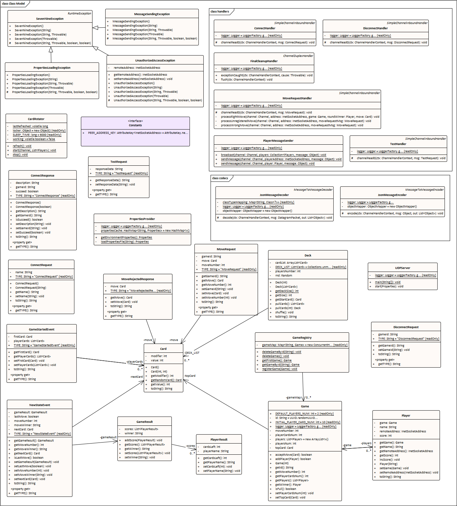
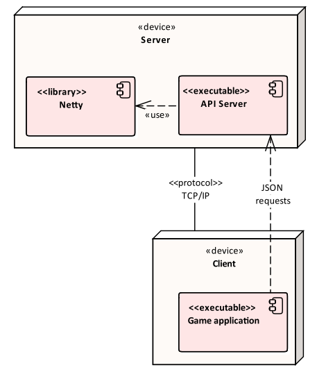
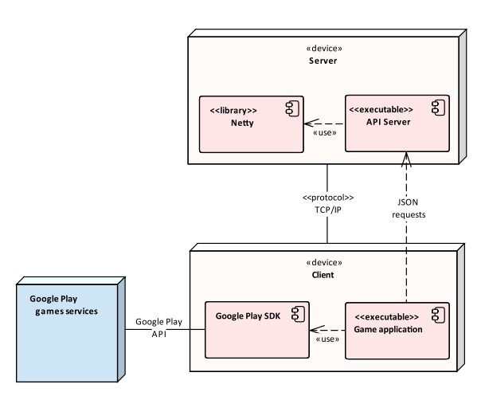

# Проектирование арихтетуры

## Архитектура сервера

### Диаграмма классов

## Общая архитектура

### As is

В диаграмме "As is" представлена текущая архитектура приложения.

### To be

В диаграмме "To be" представлена будущая архитектура.

### ToDo

Итого, планируется добавление интеграции с Google Play(GP) для:

* Авторизации пользователей
* Сохранение пользовательских данных (рейтинга)
* Создания лобби

Планируется частично либо полностью отказаться от своего сервера игры и перейти на использование серверов GP для реализации мультиплеера (требует исследования). 